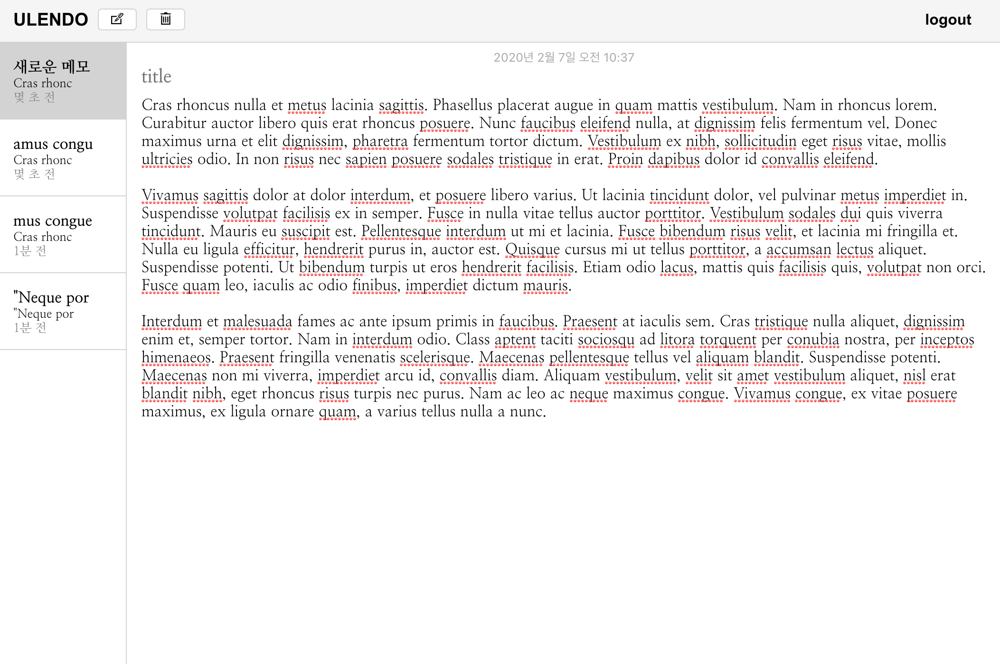

# ULENDO - Simple Memo Web App
> 실시간 동기화 메모 앱
 
Ulendo는 간단한 메모로 생각을 정리할 수 있는 메모 앱입니다. 서버를 통해 모바일과 웹에서 메모가 실시간으로 동기화되며, 현재 초기 UI와 백엔드가 제작되어 있고, 추후 디자이너와 협업하여 사용자 경험 및 프론트엔드 기능을 개선할 예정입니다.

## 웹 애플리케이션 링크
  https://ulendo.herokuapp.com/

## 앱 화면

## 개발 환경
 * 개발인원 : 1
 * 기간 : 2019.12 – 진행 중
 * 스택 :
    * 프론트 엔드 : Typescript, React, MobX
    * 백 엔드 : NodeJs, Express, Sequelize, Mysql, Heroku
